<div align="center">
  <h1>🏞️ Park Janana Management App</h1>
  
  <p>
    <strong>A comprehensive staff management solution for recreational parks</strong>
  </p>
  
  [](https://flutter.dev)
  [](https://firebase.google.com)
  [](https://dart.dev)
  
  [](https://opensource.org/licenses/MIT)
  [](http://makeapullrequest.com)
  [](https://github.com/SamerNeiroukh/Park-Janana)
  
</div>

---

## 📋 Table of Contents
- [🎯 Overview](#-overview)
- [❗ Problem Statement](#-problem-statement)
- [📋 Requirements](#-requirements)
- [✨ Features](#-features)
- [🛠️ Technical Stack](#️-technical-stack)
- [🏗️ Architecture](#️-architecture)
- [🚀 Getting Started](#-getting-started)
- [📱 Demo](#-demo)
- [🔮 Future Enhancements](#-future-enhancements)
- [🏆 Achievements](#-achievements)
- [👨‍💻 About the Developer](#-about-the-developer)
- [🤝 Contributing](#-contributing)
- [📄 License](#-license)

---

## 🎯 Overview
The **Park Janana App** is a full-stack mobile application developed in Flutter with a Firebase backend.  
It streamlines staff management, shift scheduling, task tracking, and reporting for **Park Janana**, a large multi-department recreational park in Jerusalem.

> 🏆 **Achievement**: This project was selected among the **Top 5 Final Projects (2025)** at Azrieli College of Engineering and has been tested in real-world environment.

---

## ❗ Problem Statement
Park Janana previously relied on WhatsApp, Excel, and Google Forms to manage:  
- Shifts  
- Worker communication  
- Attendance tracking  
- Task distribution  

These tools were insufficient, leading to:  
- Scheduling conflicts  
- Miscommunication  
- Lack of real-time data  
- No centralized reporting system  

---

## 📋 Requirements
Requirements were gathered from real park operations:  

- **Workers**: View shifts, request to join, clock in/out, track hours  
- **Shift Managers**: Approve/reject workers, assign tasks, monitor staff  
- **Department Managers**: Oversee departmental operations  
- **Park Manager**: Manage all departments, monitor resources  
- **Owner**: Full visibility and analytics  

---

## ✨ Features

### 🔐 Authentication & User Management
- Secure Firebase Authentication (Email/Password)  
- Role-based access: Worker, Manager, Department Manager, Owner  
- New worker registration flow  

<div align="center">
  
</div>

---

### 📊 Personalized Dashboards
- Worker dashboard: Tasks, shifts, attendance summary  
- Manager dashboard: Approvals, staff status, shift management  
- Owner dashboard: Analytics and reporting  

<div align="center">
  
  
</div>

---

### ⏰ Shift Management
- Workers request to join shifts  
- Managers approve or reject requests  
- Role-based worker assignment  
- Real-time updates with Firebase  

<div align="center">
  
  
</div>

---

### ✅ Task Management
- Create tasks for single or multiple workers  
- Track progress per worker  
- Worker dashboard: "My Tasks"  
- Manager dashboard: "All Tasks" with filtering  
- Edit and delete tasks  

<div align="center">
  
  
</div>

---

### 🕐 Attendance (Clock In/Out)
- Workers log attendance with one tap  
- Real-time session tracking  
- Automatic calculation of:  
  - Days worked (per month)  
  - Hours worked (decimal precision)  
- Motivational design with animations  

<div align="center">
  
  
  
</div>

---

### 📈 Reporting & Analytics
- Export Attendance Reports (PDF/Excel)  
- Export Task Reports (PDF)  
- Worker Shift Report with approval history  
- Data organized per month for historical records  

<div align="center">
  
  
</div>

---

### 🔄 Flow Process
<div align="center">
  
</div>

---

## 🛠️ Technical Stack

<table>
<tr>
<td><strong>📱 Frontend</strong></td>
<td>Flutter (Dart) - Cross-platform mobile development</td>
</tr>
<tr>
<td><strong>☁️ Backend</strong></td>
<td>Firebase (Firestore, Auth, Cloud Functions)</td>
</tr>
<tr>
<td><strong>🔄 DevOps</strong></td>
<td>GitHub, Azure Pipelines</td>
</tr>
<tr>
<td><strong>🎨 Design</strong></td>
<td>Figma, Custom Assets</td>
</tr>
<tr>
<td><strong>📊 Analytics</strong></td>
<td>PDF/Excel Export, Real-time reporting</td>
</tr>
</table>

### 📦 Key Dependencies
```yaml
dependencies:
  firebase_core: ^3.8.0          # Firebase SDK
  firebase_auth: ^5.3.4          # Authentication
  cloud_firestore: ^5.4.0        # Database
  google_fonts: ^6.1.0           # Typography
  fl_chart: ^0.64.0              # Charts & Analytics
  pdf: ^3.10.1                   # PDF Generation
  slide_to_act: ^2.0.1           # Interactive UI
  flutter_animate: ^4.5.2        # Animations
```  

---

## 🏗️ Architecture

```mermaid
graph TB
    A[📱 Flutter Mobile App] --> B[🔐 Firebase Auth]
    A --> C[🗄️ Firestore Database]
    A --> D[☁️ Firebase Functions]
    
    B --> E[👤 User Management]
    C --> F[⚡ Real-time Sync]
    D --> G[🔧 Business Logic]
    
    E --> H[📊 Role-based Access]
    F --> I[🔄 Live Updates]
    G --> J[📧 Notifications]
```

<div align="center">



</div>

**Architecture Flow:**
- **Flutter (UI Layer)** → Provides cross-platform mobile interface
- **Firebase Auth** → Handles secure user authentication and authorization  
- **Firestore Database** → Real-time NoSQL database for data storage
- **Firebase Functions** → Server-side logic for complex operations

<div align="center">
  
</div>

---

## 🚀 Getting Started

### Prerequisites
- **Flutter SDK** (3.5.4 or higher)
- **Dart SDK** (included with Flutter)
- **Firebase Account** for backend services
- **Android Studio** or **VS Code** with Flutter extensions

### Installation

1. **Clone the repository**
   ```bash
   git clone https://github.com/SamerNeiroukh/Park-Janana.git
   cd Park-Janana
   ```

2. **Install dependencies**
   ```bash
   flutter pub get
   ```

3. **Firebase Setup**
   - Create a new Firebase project
   - Enable Authentication (Email/Password)
   - Create Firestore database
   - Download `google-services.json` (Android) and `GoogleService-Info.plist` (iOS)
   - Place files in appropriate directories

4. **Run the application**
   ```bash
   flutter run
   ```

### 🔧 Configuration
Update Firebase configuration in:
- `android/app/google-services.json`
- `ios/Runner/GoogleService-Info.plist`
- `lib/services/firebase_service.dart`

---

## 📱 Demo

<div align="center">
  
### 🎥 Live Demo
> *Coming Soon: Video demonstration showcasing key features*

### 📸 Key Features Preview

| Feature | Screenshot | Description |
|---------|------------|-------------|
| 🔐 **Authentication** | [Login Screen] | Secure Firebase authentication |
| 📊 **Dashboard** | [Dashboard View] | Role-based personalized interface |
| ⏰ **Shift Management** | [Shift Screen] | Request and approve shifts |
| 🕐 **Attendance** | [Clock Screen] | One-tap clock in/out system |

</div>

---

## 🔮 Future Enhancements
- 📱 Push notifications for shift and task updates  
- 💬 In-app chat between managers and workers  
- 🤖 AI-based scheduling recommendations  
- 🌐 Multi-language support (Hebrew, Arabic, English)  
- 📍 GPS-based attendance verification
- 📊 Advanced analytics and reporting dashboards
- 🔗 Integration with payroll systems  

---

## 🏆 Achievements

### 🎯 Project Achievements
- 🏆 **Selected as Top 5 Final Project** at Azrieli College (2025)  
- ✅ **Real-world Testing** - Successfully deployed at Park Janana  
- 🏗️ **Scalable Architecture** - Designed for growth and expansion  
- 📈 **Performance Optimized** - Smooth real-time operations
- 🔒 **Security Focused** - Role-based access and data protection

### 💼 Skills Gained
- 📱 **Full-stack Development** with Flutter and Firebase  
- 🎨 **UI/UX Design** and custom animations  
- 🔐 **Authentication Systems** and role-based access control  
- ⚡ **Real-time Synchronization** with Firestore  
- 📊 **Data Export Solutions** (PDF/Excel generation)  
- 🔄 **CI/CD Implementation** with Azure Pipelines  
- 🧪 **Testing Strategies** for mobile applications  

---

## 👨‍💻 About the Developer

<div align="center">
  
### **Samer Neiroukh**
*Full-Stack Developer | Mobile Application Developer*

</div>

📚 **Education**: BSc in Software Engineering (2025), Azrieli College of Engineering  
💻 **Specialization**: Flutter, React, Firebase, Full-Stack Development  
🔧 **Technologies**: Java, C++, Python, Dart, JavaScript  
🌍 **Languages**: Arabic, Hebrew, English (Fluent)  

### 📞 Connect With Me
[](https://github.com/SamerNeiroukh)
[](https://linkedin.com/in/samer-neiroukh-217ab1340)

---

## 🤝 Contributing

We welcome contributions to the Park Janana Management App! Here's how you can help:

### 🚀 How to Contribute
1. **Fork** the repository
2. **Create** a feature branch (`git checkout -b feature/AmazingFeature`)
3. **Commit** your changes (`git commit -m 'Add some AmazingFeature'`)
4. **Push** to the branch (`git push origin feature/AmazingFeature`)
5. **Open** a Pull Request

### 📋 Contribution Guidelines
- Follow the existing code style and conventions
- Write clear, concise commit messages
- Update documentation for any new features
- Add tests for new functionality when applicable
- Ensure your code works on both Android and iOS

### 🐛 Bug Reports
Found a bug? Please create an issue with:
- Clear description of the problem
- Steps to reproduce
- Expected vs actual behavior
- Screenshots (if applicable)

---

## 📄 License

This project is licensed under the **MIT License** - see the [LICENSE](LICENSE) file for details.

```
MIT License

Copyright (c) 2025 Samer Neiroukh

Permission is hereby granted, free of charge, to any person obtaining a copy
of this software and associated documentation files (the "Software"), to deal
in the Software without restriction, including without limitation the rights
to use, copy, modify, merge, publish, distribute, sublicense, and/or sell
copies of the Software, and to permit persons to whom the Software is
furnished to do so, subject to the following conditions:

The above copyright notice and this permission notice shall be included in all
copies or substantial portions of the Software.
```

---

<div align="center">

### 🌟 Star this repository if you found it helpful!

**Made with ❤️ by [Samer Neiroukh](https://github.com/SamerNeiroukh)**

*Transforming park management through innovative technology* 🏞️

</div>  
